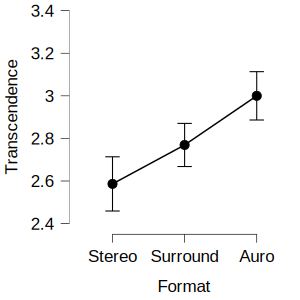

# Data set from @hahn_musical_2018
## Preparation
### Data, Packages, and Design
Load the data:
```{r dataset, messages=FALSE}
load("data/data_raw.Rda")
```
Load relevant packages:
```{r packages, message=FALSE, warning=FALSE, results='hide'}
sapply(c("tidyverse", "MANOVA.RM", "rstatix", "ggpubr"), require, character.only = T)
```
Prepare the design with vectors:
```{r formats and GEMS, message=FALSE}
formats <- c("stereo", "surround", "auro")
gems_factors <- c("wonder", "transcendence", "tenderness", "nostalgia",
                  "peacefulness", "power", "joyful_activation", "tension",
                  "sadness")
# item to factor mapping
wonder <- c("moved", "filled_with_wonder", "allured")
transcendence <- c("feeling_of_transcendence", "fascinated", "overwhelmed")
tenderness <- c("affectionate", "tender", "mellowed")
nostalgia <- c("sentimental", "dreamy", "nostalgic")
peacefulness <- c("calm", "serene", "soothed")
power <- c("energetic", "triumphant", "strong")
joyful_activation <- c("joyful", "animated", "bouncy")
tension <- c("agitated", "nervous", "tense")
sadness <- c("sad", "sorrowful", "tearful")
```
### Filtering
Exclude a participant if there are at least two `NA`s for a GEMS factor of one stimulus:
```{r filter cases, message=FALSE}
data_raw$complete <- TRUE
for (p in data_raw$participant) {
  part_data <- data_raw %>% filter(participant == p)
  for (excerpt in c("a", "b")) {
    for (format in formats) {
      for (factor in gems_factors) {
        temp_data <- part_data %>%
          dplyr::select(starts_with(paste(excerpt, format, get(factor), sep = "_")))
        nas <- temp_data %>% t() %>% is.na() %>% sum()
        if (nas > 1) {
          data_raw$complete[p] <- FALSE
        }
      }
    }
  }
}
rm(part_data, temp_data, nas, p, format, excerpt)
data_filtered <- data_raw %>% filter(complete==TRUE)
N <- length(data_filtered$participant)
```
After removing incomplete cases the data set contains `r N` participants.

### Scoring
Calculate mean values for each item per format:
```{r item means, message=FALSE, warning=FALSE}
for (format in formats) {
  for (factor in gems_factors) {
    for (item in get(factor)) {
      item_mean_vector <- data_filtered %>%
        select(ends_with(paste0(format, "_", item))) %>%
        rowMeans(na.rm = TRUE)
      eval(str2expression(paste0("data_filtered$",
                                 format, "_", item,
                                 " <- item_mean_vector")))
    }
  }
}
rm(item, item_mean_vector)
data_filtered <- data_filtered %>% mutate_all(~ifelse(is.nan(.), NA, .))
```
Calculate the mean of each factor per format across its items:
```{r factor means, message=FALSE, warning=FALSE}
for (format in formats) {
  for (factor in gems_factors) {
    factor_mean_vector <- data_filtered %>%
      select(paste0(format, "_", get(factor))) %>% 
      rowMeans(na.rm = TRUE)
    eval(str2expression(paste0("data_filtered$",
                                 format, "_", factor,
                                 " <- factor_mean_vector")))
  }
}
rm(format, factor, factor_mean_vector)
```
### Long format
```{r long formats, message=FALSE, warning=FALSE}
vars_vector <- sapply(formats,
                      function(format) {
                        paste0(format, "_", gems_factors)
                      },
                      USE.NAMES = F) %>% as.vector()
data_long_mult <- data_filtered %>% select(participant, all_of(vars_vector))
names(data_long_mult) <- names(data_long_mult) %>%
  gsub("joyful_activation", "joyfulactivation", .)
data_long_mult <- data_long_mult %>%
  pivot_longer(!participant,
               names_to = c("format", ".value"),
               names_pattern = "(.*)_(.*)")
data_long_single <- data_long_mult %>%
  pivot_longer(!c(participant, format),
               values_to = "score",
               names_to = "factor") %>% 
  mutate(factor = recode(factor,
                         joyfulactivation = "joyful activation") %>% tools::toTitleCase(),
         format = format %>% tools::toTitleCase() %>% as_factor())
names(data_long_mult) <- names(data_long_mult) %>%
  gsub("joyfulactivation", "joyful_activation", .)
data_long_mult$format <- data_long_mult$format %>% as_factor()
```
## Analyses
### Descriptives
```{r age summary, include=FALSE}
age_summary <- summary(data_filtered$age)
```
Out of the `r N` participants `r table(data_filtered$gender)[["female"]]`
indicated "female" as their gender whereas `r table(data_filtered$gender)[["male"]]`
indicated "male".
The participants' age ranged from `r age_summary[[1]]` to `r age_summary[[6]]`
with a mean of `r age_summary[[4]]` (*SD* = `r sd(data_filtered$age)`).

```{r descriptives, echo=FALSE, message=FALSE, warning=FALSE}
descriptives <- data_long_single %>% group_by(factor, format) %>%
  summarise(M = mean(score), SD = sd(score))
descriptives %>% 
  knitr::kable(col.names = c("GEMS Factor", "Format", "$M$", "$SD$"),
               align = "llcc")
```
```{r mean plot, echo=FALSE, fig.width=10, message=FALSE, warning=FALSE}
data_long_single %>% group_by(format, factor) %>%
  summarise(M = mean(score), SD = sd(score)) %>%
  ggplot(., aes(x = factor, y = M, color = format)) +
  geom_point(aes(shape = format)) +
  geom_path(aes(group = format, linetype = format)) +
  ylim(1,5) +
  theme_pubr() +
  theme(legend.position = c(.99,.99),
        legend.justification = c(1,1)
        ) +
  xlab("GEMS Factor") +
  ylab("Mean") +
  labs(color = "Format", shape = "Format", linetype = "Format")
```

### Multivariate Analysis of Variance

```{r manova}
#rm_manova <-
#  multRM(formula = cbind(wonder, transcendence, tenderness,
#                         nostalgia, peacefulness, power,
#                         joyful_activation, tension, sadness) ~ format,
#         data = data_long_mult,
#         subject = "participant",
#         within = "format",
#         para = TRUE,
#         iter = 50000,
#         dec = 5,
#         seed = 987)
load(file = "results/rm_manova.Rda")
summary(rm_manova)
```
### Analysis of Variance for *Transcendence*
#### Assumption Checks
##### Extreme Outliers
```{r anova outliers}
data_long_mult %>% group_by(format) %>%
  select(format, participant, transcendence) %>%
  identify_outliers(transcendence) %>% 
  filter(is.outlier)
ggboxplot(data_long_mult, x = "format", y = "transcendence", add = "point")
```

##### Normality: Shapiro-Wilk Test and QQ-Plots
```{r anova normality, echo=FALSE, warning=FALSE}
data_long_mult %>% group_by(format) %>%
  shapiro_test(transcendence) %>%
  select(!variable) %>%
  knitr::kable(align = "lcc",
               col.names = c("Version", "Test Statistic", "$p$"))
ggqqplot(data_long_mult, "transcendence", facet.by = "format")
```

##### Mauchly's Test for Sphericity
```{r anova}
transcendence_anova <-
  anova_test(data = data_long_mult,
             dv = transcendence,
             wid = participant,
             within = format,
             type = 3,
             effect.size = "pes")
transcendence_ges <- anova_test(data = data_long_mult,
           dv = transcendence,
           wid = participant,
           within = format,
           type = 3,
           effect.size = "ges")$ANOVA$ges
transcendence_anova$`Mauchly's Test for Sphericity` %>%
  knitr::kable(col.names = c("Effect", "$W$", "$p$", "$p<.05$"),
               align = "lccc")
```
#### Results
```{r anova results, echo=FALSE}
transcendence_res <- get_anova_table(transcendence_anova)
class(transcendence_res) <- "data.frame"
transcendence_res %>% mutate(ges = transcendence_ges) %>%
  select(!`p<.05`) %>% knitr::kable(col.names = c("Effect", "DFn", "DFd",
                                                  "$F$", "$p$",
                                                  "$\\eta^2_p$",
                                                  "$\\eta^2_G$"))
```



*Note.* Error bars represent 95% confidence intervals.
GEMS factors are on a 5-point Likert scale coded from 1 to 5.
Plot was exported from JASP [@JASP].

```{r, transcendence contrasts, echo=FALSE}
data_wide_transcendence <- data_long_single %>%
  filter(factor == "Transcendence") %>%
  mutate(across(where(is.character), tolower)) %>%
  mutate(across(where(is.factor), tolower)) %>%
  pivot_wider(id_cols = participant,
              values_from = score,
              names_from = c(format, factor),
              names_sep = "_") %>%
  mutate(diff_stereo_surround = surround_transcendence - stereo_transcendence,
         diff_stereo_auro = auro_transcendence - stereo_transcendence,
         diff_surround_auro = auro_transcendence - surround_transcendence)

transcendence_contrasts <- data_wide_transcendence %>%
  select(participant, starts_with("diff")) %>%
  pivot_longer(starts_with("diff"),
               names_to = "contrast",
               values_to = "diff",
               names_prefix = "diff_") %>%
  group_by(contrast) %>%
  summarise(mean_diff = mean(diff),
            sd_diff = sd(diff)) %>%
  mutate(format1 = str_split(contrast, "_") %>%
           lapply(function(x) x[[1]]) %>% unlist,
         format2 = str_split(contrast, "_") %>%
           lapply(function(x) x[[2]]) %>% unlist)
transcendence_contrasts$sd_diff_pooled <-
  sapply(1:3,
         function(n) {
      .5 * (
        sd(data_wide_transcendence[[str_c(transcendence_contrasts$format1[[n]], "_transcendence")]]) +
          sd(data_wide_transcendence[[str_c(transcendence_contrasts$format2[[n]], "_transcendence")]]))
           })
transcendence_contrasts$sd_diff_d_rm <-
  sapply(1:3,
         function(n) {
           format1 <-
             str_c(transcendence_contrasts$format1[[n]],
                   "_transcendence")
           format2 <-
             str_c(transcendence_contrasts$format2[[n]],
                   "_transcendence")
           sd1 <- sd(data_wide_transcendence[[format1]])
           sd2 <- sd(data_wide_transcendence[[format2]])
           cor12 <- cor(data_wide_transcendence[[format1]],
                        data_wide_transcendence[[format2]])
           out <- sqrt(2 * (1 - cor12)) /
             sqrt(sd1 ^ 2 + sd2 ^ 2 - 2 * cor12 * sd1 * sd2)
           out
         })
transcendence_contrasts <- transcendence_contrasts %>%
  mutate(cohens_d_z = mean_diff / sd_diff,
         cohens_d_av = mean_diff / sd_diff_pooled,
         cohens_d_rm = sd_diff_d_rm * mean_diff)
transcendence_contrasts %>% select(-c(format1, format2)) %>%
  knitr::kable()
```

|Contrasts         |Estimate|CI LL  |CI UL  |SE     |df   |$t$  |$p$     |
|:-----------------|:------:|:-----:|:-----:|:-----:|:---:|:---:|:------:|
|Surround -- Stereo|0.183   |0.023  |0.343  |0.081  |102  |2.266|0.026   |
|Auro -- Stereo    |0.413   |0.254  |0.573  |0.081  |102  |5.128|1.397e-6|
|Auro -- Surround  |0.231   |0.071  |0.391  |0.081  |102  |2.862|0.005   |
*Note.* Contrasts were calculated in JASP [@JASP].

### Correlations for *Transcendence*
#### Correlations Between the Formats
```{r correlations, include=FALSE}
cor_stereo_surround <-
  cor.test(data_filtered$stereo_transcendence,
           data_filtered$surround_transcendence,
           alternative = "greater",
           method = "pearson",
           conf.level = .95)
cor_stereo_auro <-
  cor.test(data_filtered$stereo_transcendence,
           data_filtered$auro_transcendence,
           alternative = "greater",
           method = "pearson",
           conf.level = .95)
cor_surround_auro <-
  cor.test(data_filtered$surround_transcendence,
           data_filtered$auro_transcendence,
           alternative = "greater",
           method = "pearson",
           conf.level = .95)
cor_table <- data.frame(Formats = c("Stereo -- Surround",
                                    "Stereo -- Auro",
                                    "Surround -- Auro"),
                        r = c(cor_stereo_surround$estimate,
                              cor_stereo_auro$estimate,
                              cor_surround_auro$estimate),
                        p = c(cor_stereo_surround$p.value,
                              cor_stereo_auro$p.value,
                              cor_surround_auro$p.value),
                        LL = c(cor_stereo_surround$conf.int[1],
                              cor_stereo_auro$conf.int[1],
                              cor_surround_auro$conf.int[1]),
                        UL = c(cor_stereo_surround$conf.int[2],
                              cor_stereo_auro$conf.int[2],
                              cor_surround_auro$conf.int[2])) %>% 
  mutate(`Fisher's z` = atanh(r),
         p = sapply(p,
                    function(x) ifelse(x < 10^-3, "< .001", x)))
```
```{r correlations table, echo=FALSE}
knitr::kable(cor_table %>% 
  mutate(across(where(is.numeric), round, digits = 4)),
             col.names = c("Formats", "$r$", "$p$", "CI LL", "CI UL", "Fisher's $z$"),
             align = "lccccc")
```

#### Average Correlation
To get a mean correlation individual correlation coefficients have to be
Fisher $z$-transformed [@corey_averaging_1998].
The Fisher $z$-transformation is equivalent to the inverse hyperbolic tangent.
```{r average correlations}
avg_cor_z <- mean(cor_table$`Fisher's z`)
avg_cor_r <- tanh(avg_cor_z)
```
Taking the averaged Fisher $z$-transformed values results in a value of
`r round(avg_cor_z, 4)`.
Back-transformed to Person's $r$ the average correlation between the three
audio formats for the GEMS factor Transcendence is `r round(avg_cor_r, 4)`.

### Common Language Effect Sizes for *Transcendence*
The common language effect size (CLE) expresses "the probability that an
individual has a higher value on one measurement than the other"
[@lakens_calculating_2013, p.4].
The CLE is therefore the probability that a $Z$-score is greater than a
specific $Z_{\textrm{CLE}}$ (given a standard normal distribution).
For repeated measures the $Z_{\textrm{CLE}}$ is calculated from the means
and standard deviations from two measurements as well as their correlation
[@mcgraw_common_1992]:
$$
Z_{\textrm{CLE}} =
\frac{M_2 - M_1}{\sqrt{SD_1^2+SD_2^2-2\cdot{}SD_1\cdot{}SD_2\cdot{}r_{12}}}
$$
```{r cle function}
get_cle <- function(mean1, mean2, sd1, sd2, r12) {
  Z_cle <- (mean2 - mean1) / sqrt(sd1^2 + sd2^2 - 2 * sd1 * sd2 * r12)
  Z_cle %>% pnorm(lower.tail = F)
}
```
```{r cle table}
cle_table <- data.frame(format1 = c("Auro", "Auro", "Surround"),
                        format2 = c("Surround", "Stereo", "Stereo"))
cle_table$cle <-
  mapply(function(f1, f2) {
    desc <- descriptives %>% filter(factor == "Transcendence")
    get_cle(mean1 = desc$M[desc$format == f1],
            mean2 = desc$M[desc$format == f2],
            sd1 = desc$SD[desc$format == f1],
            sd2 = desc$SD[desc$format == f2],
            r12 = cor_table$r[cor_table$Formats == paste(f2, f1,
                                                         sep = " -- ")])
  },
  cle_table$format1, cle_table$format2)
cle_table %>% mutate(across(where(is.numeric), round, digits = 4)) %>% 
  knitr::kable(col.names = c("Format 1", "Format 2", "CLE"),
               align = "llc")
```
Using the correction formula for multiple groups from @mcgraw_common_1992,
the CLE for higher values in Auro than in Stereo and Surround is:
```{r cle auro versus stereo and surround}
p_auro <- .88 * prod(cle_table$cle[cle_table$format1 == "Auro"]) + .11
p_auro
```
Thus, the probability that a random participant scored higher in Auro than
in Stereo and Surround is `r round(p_auro, digits = 4)*100`%.

# Data set from @wycisk_wrapped_2022
## Preparation
Load the outlier-adjusted data from @wycisk_wrapped_2022 containing
*N* = 190 participants.
Then calculate the IMEI score, i.e., the average of the ten items, as
well as the mean IMEI score per audio format.
```{r imei data}
imei_data <- read.csv("data/imei_data_outlier_adjusted.csv")
imei_items <- paste0("imei", c(15,8,12,21,19,6,11,5,7,4))
imei_data_long <- imei_data %>% select(participant, piece,
                            version, all_of(imei_items)) %>%
  mutate(piece = piece %>% recode("1" = "radio", "2" = "hantel",
                                  "3" = "jene", "4" = "rokoko"),
         version = version %>% recode("1" = "mono", "2" = "stereo",
                                      "3" = "3d") %>% as_factor())
imei_data_long$imei <- imei_data_long %>%
  select(all_of(imei_items)) %>% rowMeans()
imei_data_wide <- imei_data_long %>%
  pivot_wider(id_cols = participant,
              names_from = c(piece, version),
              values_from = imei,
              names_glue = "{piece}_{version}_imei")
for (v in c("mono", "stereo", "3d")) {
  temp <- imei_data_wide %>% select(contains(v)) %>% rowMeans()
  eval(str2expression(paste0("imei_data_wide$mean_", v, "_imei <- temp")))
}
rm(temp, v)
```

## IMEI Correlations Across Audio Formats
```{r imei correlations, include=FALSE}
imei_cor_mono_stereo <-
  cor.test(imei_data_wide$mean_mono_imei, imei_data_wide$mean_stereo_imei,
           alternative = "greater",
           method = "pearson",
           conf.level = .95)
imei_cor_mono_3d <-
  cor.test(imei_data_wide$mean_mono_imei, imei_data_wide$mean_3d_imei,
           alternative = "greater",
           method = "pearson",
           conf.level = .95)
imei_cor_stereo_3d <-
  cor.test(imei_data_wide$mean_stereo_imei, imei_data_wide$mean_3d_imei,
           alternative = "greater",
           method = "pearson",
           conf.level = .95)
imei_cor_table <- data.frame(Formats = c("Mono -- Stereo",
                                    "Mono -- 3D",
                                    "Stereo -- 3D"),
                             r = c(imei_cor_mono_stereo$estimate,
                                   imei_cor_mono_3d$estimate,
                                   imei_cor_stereo_3d$estimate),
                             p = c(imei_cor_mono_stereo$p.value,
                                   imei_cor_mono_3d$p.value,
                                   imei_cor_stereo_3d$p.value),
                             LL = c(imei_cor_mono_stereo$conf.int[1],
                                    imei_cor_mono_3d$conf.int[1],
                                    imei_cor_stereo_3d$conf.int[1]),
                             UL = c(imei_cor_mono_stereo$conf.int[2],
                                    imei_cor_mono_3d$conf.int[2],
                                    imei_cor_stereo_3d$conf.int[2])) %>%
  mutate(`Fisher's z` = atanh(r),
         p = sapply(p,
                    function(x) ifelse(x < 10^-3, "< .001", x))) %>%
  add_row(Formats = "Average",
          r = mean(.$r),
          `Fisher's z` = mean(.$`Fisher's z`)) %>%
  add_row(Formats = "Back-transformed Fisher's $z$ average",
          r = tanh(.$`Fisher's z`[.$Formats == "Average"]))
```
```{r imei correlation table, echo=FALSE}
options(knitr.kable.NA = "")
imei_cor_table %>% knitr::kable(align = "lccccc",
                                col.names = c("", "$r$", "$p$", "CI LL",
                                              "CI UL", "Fisher's $z$"))
```
## IMEI ANOVA
### IMEI Descriptives
```{r imei anova preparation, echo=FALSE, message=FALSE, warning=FALSE}
imei_data_long_anova <- imei_data_long %>%
  select(participant, piece, version, imei) %>%
  mutate(version = version %>% as_factor() %>%
           recode_factor(mono = "Mono",
                         stereo = "Stereo",
                         `3d` = "3D")) %>%
  group_by(participant, version) %>%
  summarise(imei = mean(imei))
imei_data_long_anova %>% group_by(version) %>%
  get_summary_stats(imei, type = "mean_sd") %>%
  select(!c(variable, n)) %>%
  knitr::kable(col.names = c("Version", "$M$", "$SD$"))
```
```{r imei boxplot, echo=FALSE}
imei_data_long_anova %>% ggboxplot(x = "version", y = "imei") +
  ylab("IMEI") +
  xlab("Version")
```

### Outliers
```{r imei anova outliers}
imei_data_long_anova %>% group_by(version) %>% identify_outliers(imei)
```
### Normality: Shapiro-Wilk Test and QQ-Plots
```{r imei anova normality, echo=FALSE, warning=FALSE}
imei_data_long_anova %>% group_by(version) %>% shapiro_test(imei) %>%
  select(!variable) %>%
  knitr::kable(align = "lcc",
               col.names = c("Version", "Test Statistic", "$p$"))
ggqqplot(imei_data_long_anova, "imei", facet.by = "version")
```
```{r imei anova test, include=FALSE}
imei_anova <- anova_test(data = imei_data_long_anova %>% ungroup(),
                         dv = imei,
                         wid = participant,
                         within = version,
                         effect.size = "pes",
                         detailed = TRUE)
imei_anova_ges <- anova_test(data = imei_data_long_anova %>% ungroup(),
                             dv = imei,
                             wid = participant,
                             within = version,
                             effect.size = "ges",
                             detailed = TRUE)$ANOVA$ges
imei_anova_results <- get_anova_table(imei_anova)
class(imei_anova_results) <- "data.frame"
imei_anova_results <- imei_anova_results %>%
  mutate(ges = imei_anova_ges)
```
### Mauchly's Test for Sphericity
```{r anova sphericity, echo=FALSE}
imei_anova$`Mauchly's Test for Sphericity` %>%
  knitr::kable(col.names = c("Effect", "$W$", "$p$", "$p<.05$"),
               align = "lccc")
imei_anova$`Sphericity Corrections` %>% select(!ends_with("<.05")) %>%
  knitr::kable(col.names = c("Effect", "Grennhouse-Geisser $\\epsilon$",
                             "df(G-G)", "$p$(G-G)", "Huynh-Feldt $\\epsilon$",
                             "df(H-F)", "$p$(H-F)"),
               align = "lccrccr")
```
### Results
```{r anova table, echo=FALSE}
imei_anova_results %>% select(!c(`p<.05`, SSn, SSd)) %>%
  filter(Effect != "(Intercept)") %>%
  mutate(p = sapply(p, function(x) ifelse(x < .001, "< .001", x))) %>%
  knitr::kable(col.names = c("Effect", "DFn", "DFd",
                              "$F$", "$p$",
                              "$\\eta^2_p$",
                              "$\\eta^2_G$"),
               align = "lcccccc")
```

## IMEI CLEs
```{r imei cle, echo=FALSE}
imei_cle_table <- data.frame(format1 = c("3D", "3D", "Stereo"),
                             format2 = c("Stereo", "Mono", "Mono"))
imei_cle_table$cle <-
  mapply(function(f1, f2) {
    desc <- imei_data_long_anova %>% group_by(version) %>%
      summarise(M = mean(imei), SD = sd(imei))
    get_cle(mean1 = desc$M[desc$version == f1],
            mean2 = desc$M[desc$version == f2],
            sd1 = desc$SD[desc$version == f1],
            sd2 = desc$SD[desc$version == f2],
            r12 = imei_cor_table$r[imei_cor_table$Formats == paste(f2, f1,
                                                                   sep = " -- ")])},
    imei_cle_table$format1, imei_cle_table$format2)
imei_cle_table %>% mutate(across(where(is.numeric), round, digits = 4)) %>% 
  knitr::kable(col.names = c("Format 1", "Format 2", "CLE"),
               align = "llc")
```

```{r imei cle 3d vs stereo and mono}
p_3d <- .88 * prod(imei_cle_table$cle[imei_cle_table$format1 == "3D"]) + .11
```
Once again using the correction formula for multiple conditions from
@mcgraw_common_1992, the CLE for 3D versus Stereo and Mono is `r p_3d`.

# References
